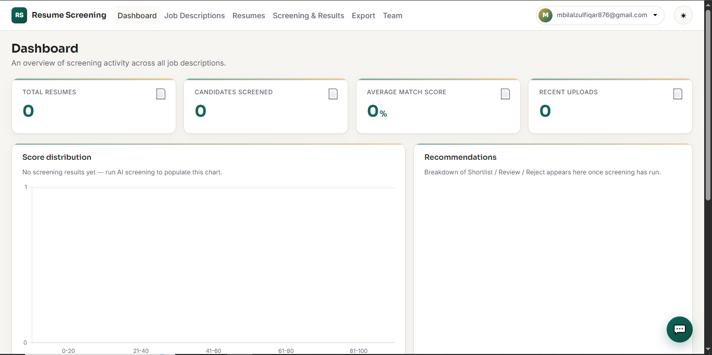
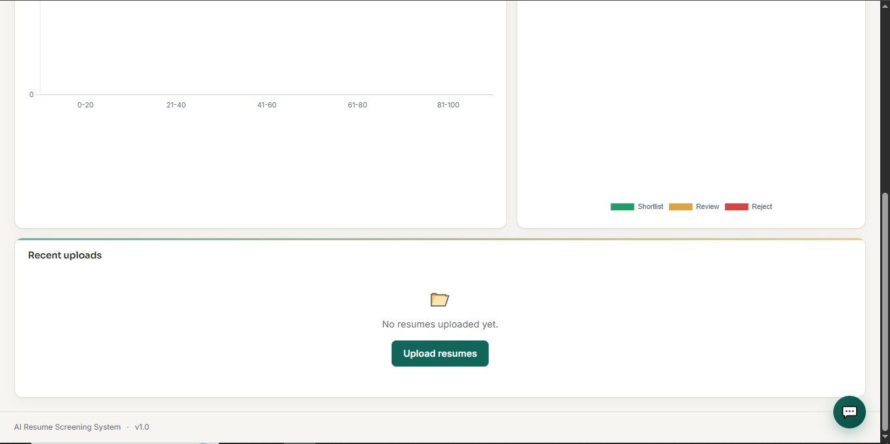
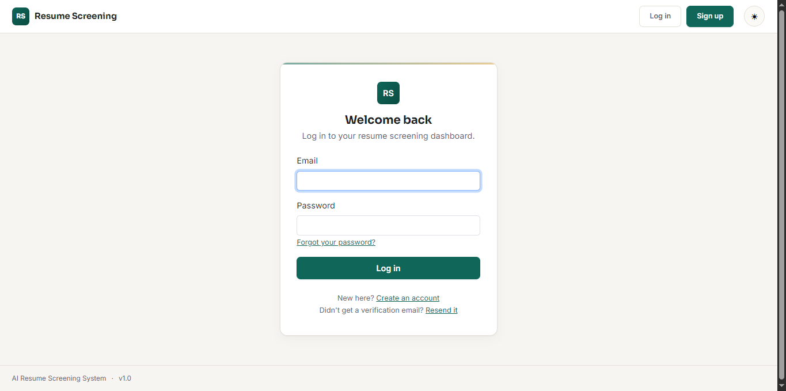
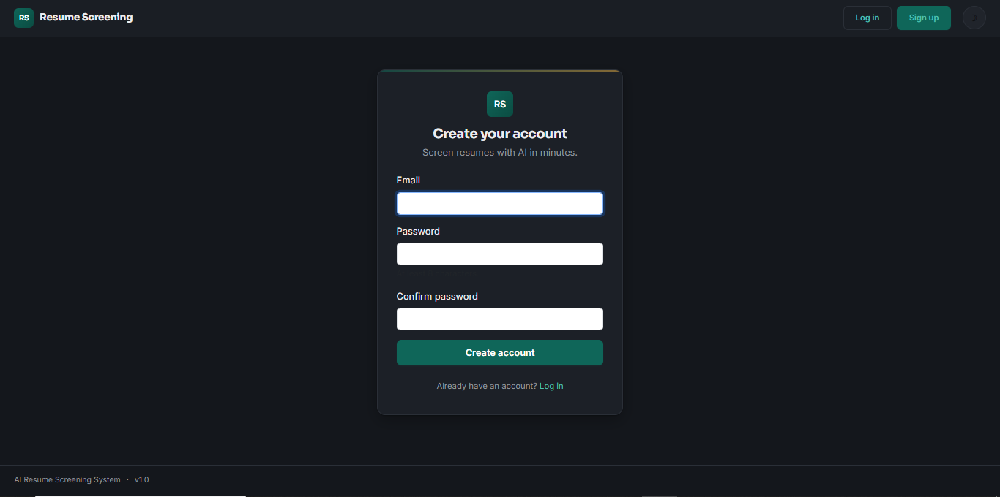
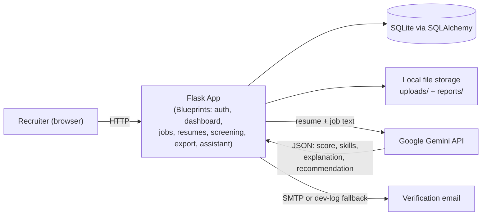

<div align="center">


<a href="#">
  
</a>

<br>


</div>

## Table of Contents

- [Overview](#overview)
- [Features](#features)
- [Screenshots](#screenshots)
- [Architecture](#architecture)
- [Tech Stack](#tech-stack)
- [Folder Structure](#folder-structure)
- [Installation](#installation)
- [Environment Variables](#environment-variables)
- [Usage Walkthrough](#usage-walkthrough)
- [How AI Screening Works](#how-ai-screening-works)
- [Built-in App Assistant](#built-in-app-assistant)
- [Security & Privacy](#security--privacy)
- [Testing Status](#testing-status)
- [Upgrade Ideas / Roadmap](#upgrade-ideas--roadmap)
- [Contributing](#contributing)
- [License](#license)

---

## Overview

**AI Resume Screening System** is a self-hosted recruiting tool that lets a recruiter upload a batch of resumes, paste or upload a job description, and get every candidate automatically scored, ranked, and explained by Google's **Gemini API** — matching skills, missing skills, education, experience, and a plain-English recommendation (**Shortlist / Review / Reject**).

It's a full-stack Flask app: server-rendered pages (Jinja2 + Bootstrap 5), a SQLite database via SQLAlchemy, real file handling (PDF text extraction), a real AI integration (not a mock), account creation with email verification, and a small rule-based assistant that only answers questions about the app itself.

> 📌 **Status:** Feature-complete for personal/internal use. See [Testing Status](#testing-status) and [Security & Privacy](#security--privacy) before deploying publicly.

---

## Features

**🔐 Accounts**
- Email/password registration with email verification (24h link expiry)
- Every page requires login; a rule-based assistant only appears once signed in
- Local dev mode logs the verification link instead of requiring real SMTP

**📊 Dashboard**
- Live counts: total resumes, candidates screened, average match score
- Score-distribution histogram and Shortlist/Review/Reject breakdown (Chart.js, theme-aware)
- Recent uploads with live status

**📄 Job Descriptions**
- Paste text or upload `.txt` / `.pdf`
- Automatic keyword-based skill detection
- Reusable across as many screening runs as you like

**📥 Resume Upload**
- Drag-and-drop, multi-file, real upload progress bar
- PDF text extraction with a clear `Needs OCR` state for scanned/no-text-layer PDFs
- Per-file failure reporting — one bad file never blocks the rest of a batch

**🤖 AI Screening (Gemini)**
- Structured JSON scoring: 0–100 match score, matching/missing skills, extracted education & experience, plain-English explanation, recommendation
- Retries with backoff, strict schema validation, and graceful per-resume failure handling (a Gemini hiccup never kills the batch)

**📈 Results**
- Sortable, paginated results table (name, score, experience, skills, recommendation)
- Live search by name, filter by score range, filter by recommendation — no page reload
- Full per-candidate report page with a score gauge and explanation

**📤 Export**
- CSV and formatted PDF export
- Exports exactly what's currently visible after your filters — not just "everything"

**💬 Built-in App Assistant**
- Floating chat widget, rule-based (no LLM call), answers questions about using this app only

**🎨 UI**
- Full dark/light mode with persisted preference
- Responsive layout, toast notifications, loading states, accessible focus states & skip link

---

## Screenshots

| Dashboard |Dashboard |
|---|---|
|  |  |

| Login | Register |
|---|---|
|  |  |

---

## Architecture



Request flow for a screenig run: **pick a job description → select resumes → Flask calls Gemini once per resume → validated JSON is persisted as a `ScreeningResult` → results page queries and renders it.**

---

## Tech Stack

| Layer | Technology |
|---|---|
| Backend | Python 3.11+, Flask 3 (application factory + Blueprints) |
| ORM / DB | SQLAlchemy, SQLite (Postgres/MySQL-ready via `DATABASE_URL`) |
| Auth | Flask-Login, Werkzeug password hashing, custom email-verification tokens |
| AI | Google Gemini API (`google-generativeai`), structured JSON output |
| PDF parsing | `pdfplumber` |
| Export | Python `csv` (stdlib), `reportlab` (PDF) |
| Frontend | Jinja2, Bootstrap 5, vanilla JS (no SPA framework), Chart.js |
| Email | stdlib `smtplib`, with a console-log fallback in development |

---

## Folder Structure

```
ai_resume_screening/
├── app.py                  # App factory, login gate, logging, error handlers
├── config.py                # Environment-driven config (dev/prod/testing)
├── seed.py                  # Demo data + demo login (flask seed-db)
├── requirements.txt
├── .env.example
├── models/                  # SQLAlchemy models (User, JobDescription, Resume, ScreeningResult)
├── routes/                  # Blueprints: auth, dashboard, jobs, resumes, screening, export, assistant
├── services/                 # Business logic: gemini_service, scoring_service, jd_service,
│                             #   resume_service, export_service, auth_service, email_service,
│                             #   assistant_service
├── templates/                # Jinja2 templates, one folder per blueprint
├── static/
│   ├── css/style.css        # Full design system (light/dark, components)
│   └── js/                  # theme, upload (drag-drop), data-table (sort/filter/paginate),
│                             #   toast, assistant
├── uploads/                  # Uploaded resumes & job description files (gitignored)
├── reports/                  # Generated CSV/PDF exports (gitignored)
├── database/                 # SQLite file lives here (gitignored)
└── logs/                     # Rotating app.log (gitignored)
```

---

## Installation

```bash
# 1. Clone and enter the project
git clone <your-repo-url>
cd ai_resume_screening

# 2. Create and activate a virtual environment
python -m venv venv
source venv/bin/activate        # Windows: venv\Scripts\activate

# 3. Install dependencies
pip install -r requirements.txt

# 4. Configure environment
cp .env.example .env
# then edit .env — at minimum set GEMINI_API_KEY to enable AI screening

# 5. (Optional) seed demo data + a ready-to-use login
flask seed-db
# creates demo@resume-screening.local / DemoPass123

# 6. Run
python app.py
# → http://localhost:5000
```

No `GEMINI_API_KEY`? The app still runs — everything works except the actual AI scoring step, which fails cleanly with a logged warning instead of crashing.

No `MAIL_SERVER`? Verification links are logged to the console / `logs/app.log` instead of emailed, so registration works immediately in development.

---

## Environment Variables

| Variable | Required | Default | Purpose |
|---|---|---|---|
| `SECRET_KEY` | **Yes** in production | dev key | Session signing |
| `DATABASE_URL` | No | local SQLite | Swap in Postgres/MySQL for production |
| `GEMINI_API_KEY` | For AI screening | — | Google Gemini API key |
| `GEMINI_MODEL` | No | `gemini-2.0-flash` | Model name |
| `GEMINI_MAX_RETRIES` | No | `3` | Retry attempts per screening call |
| `GEMINI_TIMEOUT_SECONDS` | No | `60` | Per-call timeout |
| `MAIL_SERVER` | No | *(blank → dev-log mode)* | SMTP host for real verification emails |
| `MAIL_PORT` / `MAIL_USE_TLS` | No | `587` / `true` | SMTP connection settings |
| `MAIL_USERNAME` / `MAIL_PASSWORD` | With `MAIL_SERVER` | — | SMTP credentials |
| `MAIL_DEFAULT_SENDER` | No | `no-reply@resume-screening.local` | From address |
| `LOG_LEVEL` | No | `INFO` | App log verbosity |

Full list with comments: [`.env.example`](.env.example).

---

## Usage Walkthrough

1. **Register** at `/auth/register` → check the console/log (or your inbox, if SMTP is configured) for the verification link.
2. **Verify & log in** — clicking the link verifies and logs you in automatically.
3. **Create a job description** — Job Descriptions → New → paste text or upload a file.
4. **Upload resumes** — Resumes → Upload → drag and drop one or more PDFs.
5. **Run screening** — Screening → pick the job description → select resumes → *Run AI screening*.
6. **Review results** — sortable table, search by name, filter by score/recommendation, click through to a full report.
7. **Export** — CSV or PDF, reflecting exactly what's currently filtered on screen.
8. **Ask the assistant** — the chat bubble (bottom-right) answers "how do I…" questions about the app itself.

---

## How AI Screening Works

For each resume, the app sends a structured prompt to Gemini containing the resume text and the job description text, and requires a strict JSON response:

```json
{
  "candidate_name": "string or null",
  "extracted_skills": ["..."],
  "extracted_education": [{ "degree": "...", "institution": "..." }],
  "extracted_experience": [{ "title": "...", "company": "...", "years": 0 }],
  "matching_skills": ["..."],
  "missing_skills": ["..."],
  "match_score": 0,
  "explanation": "...",
  "recommendation": "Shortlist | Review | Reject"
}
```

The response is validated and clamped (score forced into 0–100, missing/invalid fields default safely) before being stored. If Gemini's own `recommendation` is missing or invalid, it's derived from `SHORTLIST_THRESHOLD` (default 75) and `REVIEW_THRESHOLD` (default 50) in `config.py`. Any API failure — timeout, bad JSON, network error — is retried, then recorded as a `Failed` result instead of crashing the batch.

---

## Built-in App Assistant

The chat bubble is **rule-based, not an LLM call** — `services/assistant_service.py` matches your message against a fixed set of patterns (uploading, screening, scoring, exporting, filtering, accounts, privacy, etc.) and returns one of a fixed set of canned answers. Off-topic questions always get the same honest fallback: it can only help with using this app. Zero API cost, zero latency, zero risk of it saying something unexpected.

---

## Security & Privacy

- Passwords are hashed with Werkzeug's `generate_password_hash` (never stored in plain text).
- Resume/job description text is sent to Google's Gemini API **only** when you click "Run AI screening" — nothing else leaves the server.
- All data lives in your own SQLite database and local `uploads/`/`reports/` folders by default.

**Known limitations — read before deploying publicly:**
- No CSRF protection on forms (fine for personal/internal use; add `Flask-WTF` before exposing this to the internet).
- No rate limiting on login/register (no brute-force protection yet).
- No "forgot password" flow — only initial email verification exists.
- `db.create_all()` is used instead of migrations — safe for now, risky once you start changing the schema on a live database.

---

## Testing Status

There is currently **no automated test suite** (no `pytest` files). Every feature has instead been manually exercised end-to-end during development — including real generated PDF fixtures for upload/OCR-fallback testing, and mocked Gemini responses (only the network call is mocked) to verify the full screening pipeline, retries, and failure handling. Live calls to the real Gemini API have not been verified from this environment specifically — test with your own `GEMINI_API_KEY` before relying on it.

---

## Upgrade Ideas / Roadmap

Short version — see **[ROADMAP.md](ROADMAP.md)** for the full, prioritized list:

- 🔐 CSRF protection, rate limiting, password reset, optional 2FA
- 🧪 Automated test suite (pytest), CI pipeline, Alembic migrations, Docker
- 🤖 Async/queued screening (Celery/RQ) for large batches, OCR for scanned PDFs
- 📊 Candidate notes/tags, saved filter views, email notifications, analytics dashboard
- 👥 Multi-user teams with roles/permissions (currently single-tenant, any verified user sees all data)
- ☁️ S3-compatible storage, production deployment guide (gunicorn + nginx / Docker Compose)

---

## Contributing

Issues and pull requests are welcome. Please keep changes scoped, follow the existing service/route/template layering, and update this README if you add a feature.

---

## License

Released under the [MIT License](LICENSE).

<div align="center">


</div>
